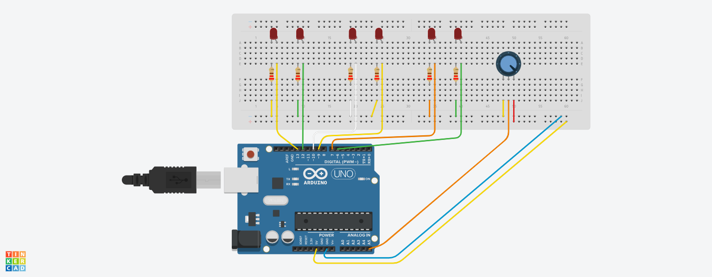
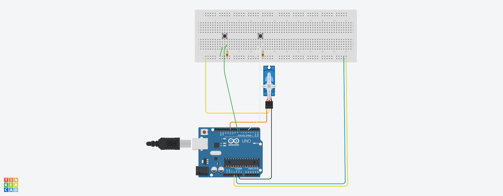
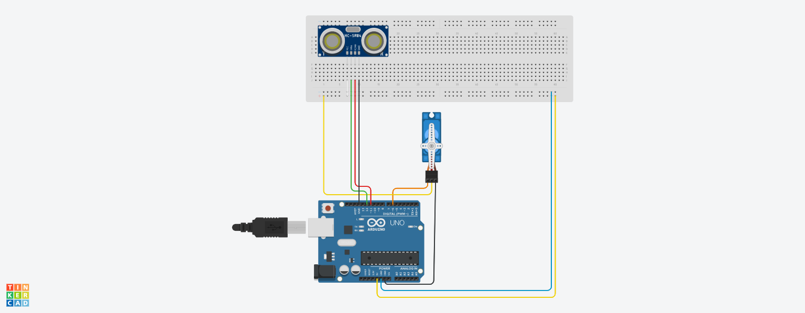

# Opdracht 1

- Sluit 2 LED's aan op poort 10 en 13
- Laat de LED's om en om knipperen (2s / 2s)
- Eerst sketch maken
- Dan tinkeren en testen
- Dan opbouwen en testen

## Componenten

- 2 LED lampen
- 2 resistors 22&#937;
- 8 bedradingen
- 1 Arduino
- 1 USB kabel
- breadboard

Bron: powerpoint Startworkshop

# Opdracht 2

- Sluit 8 LED’s aan op externe poorten
- Laat de LED’s heen en weer lopen volgens deze link: http://bit.ly/ArduinoOpdracht3
- Eerst een Sketch maken, dan Tinkeren en daarna testen
- Als laatste opbouwen en testen

## Componenten

- 8 LED lampen
- 8 resistors 22&#937;
- 20 bedradingen
- 1 Arduino
- 1 USB kabel
- breadboard

Bron: powerpoint Startworkshop

# Opdracht 3

- Sluit een LED aan op poort 5 en een op poort 11
- Sluit een knop aan op poort 8
- Laat de 1e LED aangaan door de druk op een drukknop 
- Laat de 1e LED uitgaan door de druk op dezelfde drukknop 
- De 2e LED zal altijd tegenovergesteld reageren 
- Tip 1: Gebruik een teller, als delen door 2 geen rest oplevert, dan LED uit.  
(teller % 2 == 0)
- Tip 2: Na elke knopindruk een delay van 50 ms inlassen (contactdender)

## Componenten

- 2 LED lampen
- 1 drukknop
- 2 resistors 22&#937;
- 1 resistor 10K&#937;
- 8 bedradingen
- 1 Arduino
- 1 USB kabel
- breadboard

Bron: powerpoint Startworkshop

# Opdracht 4

Maak een sketch om 6 LED’s aan te sturen afhankelijk van de hoekverdraaiing van de potmeter ( Eerst Tinkeren!! ) 

Je mag zelf de uitgangen kiezen waar de LED’s op worden aangesloten, je mag ook de analoge ingang zelf kiezen.
- Vergeet niet de voorschakelweerstanden te gebruiken.
- Hoe verder je de knop naar rechts ( 1023 ) draait, hoe meer LED’s er uit gaan

## Componenten

- 6 LED lampen
- 6 resistors 22&#937;
- 1 potmeter
- 17 bedradingen
- 1 Arduino
- 1 USB kabel
- breadboard

Bron: powerpoint Vervolgworkshop

# Opdracht 5

- Op de Arduino zijn 2 drukknoppen aangesloten. 
- Zolang op drukknop 1 wordt gedrukt draait een servomotor van 0° naar 120° in 3s. 
Als de servomotor zijn uiterste stand heeft bereikt dan moet hij terugdraaien, ook in 3s. 
- Zolang op drukknop 2 wordt gedrukt draait een servomotor van 0° naar 120° in 0,5s.  
Als de servomotor zijn uiterste stand heeft bereikt dan moet hij terugdraaien, ook in 0,5s. 
- Worden beide drukknoppen tegelijk ingedrukt, dan zal de servomotor in 3s van 0° naar 120° draaien, 
5s zo blijven staan en vervolgens in 0.5s terugdraaien naar 0°. 
- De beweging van de servomotor dient in één functie / methode te zijn ontworpen. 
- Ingangen en uitgangen zijn vrij te kiezen.

## Componenten

- 2 drukknoppen
- 1 servomotor
- 2 resistors 10K&#937;
- 10 bedradingen
- 1 Arduino
- 1 USB kabel
- breadboard

Bron: powerpoint Vervolgworkshop

# Opdracht 6
Maak een schakeling en een sketch waarbij: 

- Een servomotor in rust op 0⁰ staat. 
- Als een object binnen 10 cm van de ultrasoon zender / ontvanger komt, dan staat de motor linksom. 
- Als het object op 4 cm staat, staat de servo volledig rechtsom ( 180⁰ ). 
- Alle afstanden hiertussen zullen een bijbehorende hoek krijgen. 

- Doe dus eerst onderzoek naar hoe deze sensor werkt. Deze zit niet in jouw kitje, dus kom deze bij de docent halen. 
Deze zit wel standaard in Tinkercad.

## Componenten

- 1 ultrasoon sensor
- 1 servomotor
- 1 doos als object
- 10 bedradingen
- 1 Arduino
- 1 USB kabel
- breadboard

Bron: https://www.tinkercad.com/things/euLnGXfzpMk-ultrasonic-distance-sensor-with-servo-motor

