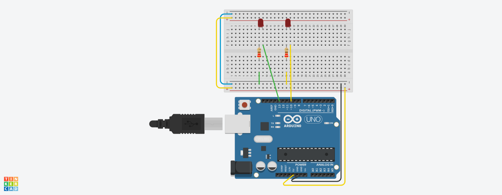

## Opdracht 1

- Sluit 2 LED's aan op poort 10 en 13
- Laat de LED's om en om knipperen (2s / 2s)
- Eerst sketch maken
- Dan tinkeren en testen
- Dan opbouwen en testen

## Componenten

- 2 LED lampen
- 2 resistors 22&#937;

