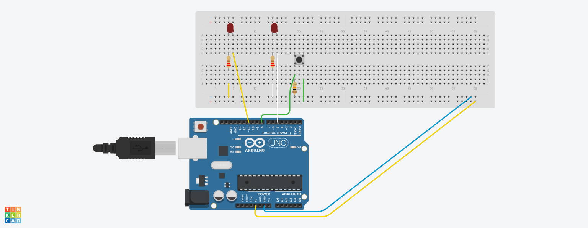

# Opdracht 1

- Sluit 2 LED's aan op poort 10 en 13
- Laat de LED's om en om knipperen (2s / 2s)
- Eerst sketch maken
- Dan tinkeren en testen
- Dan opbouwen en testen

## Componenten

- 2 LED lampen
- 2 resistors 22&#937;

# Opdracht 2

- Sluit 8 LED’s aan op externe poorten
- Laat de LED’s heen en weer lopen volgens deze link: http://bit.ly/ArduinoOpdracht3
- Eerst een Sketch maken, dan Tinkeren en daarna testen
- Als laatste opbouwen en testen

## Componenten

- 8 LED lampen
- 8 resistors 22&#937;

# Opdracht 3

- Sluit een LED aan op poort 5 en een op poort 11
- Sluit een knop aan op poort 8
- Laat de 1e LED aangaan door de druk op een drukknop 
- Laat de 1e LED uitgaan door de druk op dezelfde drukknop 
- De 2e LED zal altijd tegenovergesteld reageren 
- Tip 1: Gebruik een teller, als delen door 2 geen rest oplevert, dan LED uit.  
(teller % 2 == 0)
- Tip 2: Na elke knopindruk een delay van 50 ms inlassen (contactdender)

## Componenten

- 2 LED lampen
- 1 drukknop
- 2 resistors 22&#937;
- 1 resistor 10K&#937;

