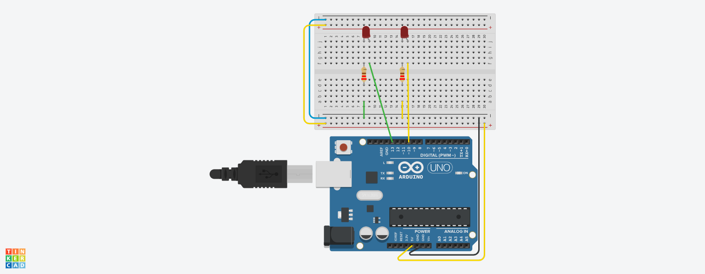
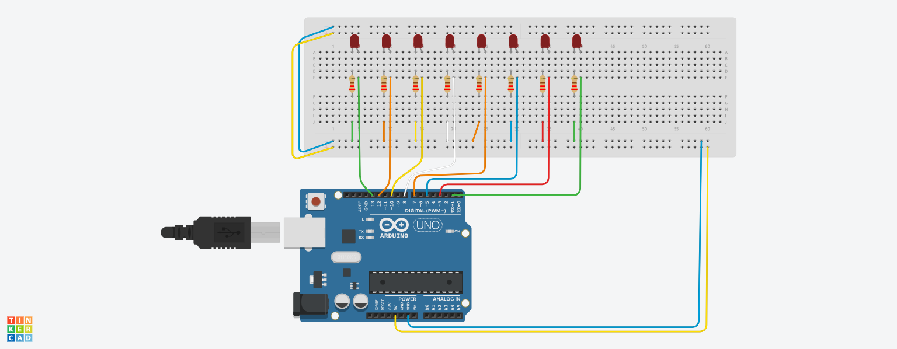

## Opdracht 1

- Sluit 2 LED's aan op poort 10 en 13
- Laat de LED's om en om knipperen (2s / 2s)
- Eerst sketch maken
- Dan tinkeren en testen
- Dan opbouwen en testen

## Componenten

- 2 LED lampen
- 2 resistors 22&#937;

## Opdracht 2

- Sluit 8 LED’s aan op externe poorten
- Laat de LED’s heen en weer lopen volgens deze link: http://bit.ly/ArduinoOpdracht3
- Eerst een Sketch maken, dan Tinkeren en daarna testen
- Als laatste opbouwen en testen

## Componenten

- 8 LED lampen
- 8 resistors 22&#937;

